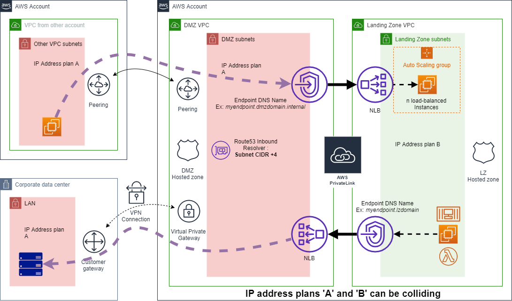

# Interconnect DMZ Pattern for AWS

AWS Cloud customers that want to seggregate their resources at network level have a large set of options (Security Group, NACL, PrivateLink...).
As the needs become more recurrent, some use-cases can be addressed with patterns.

The 'Interconnect DMZ Pattern for AWS' is an automated orchestration of security services to interconnnect securely environments that do not
share the same governance. Example of constraints:    
* Different IP Address plan management (possibily colliding),
* Different Security rules. 
* Different internal DNS structures (possible colliding).

A typical use-case is interconnecting a customer with business partners. The described solution offers a fully managed way to do it with standard AWS services.

The 'Interconnect DMZ Pattern for AWS' enables 2-way communications between the 'DMZ' side (RED side) and the customer 'Landing Zone' side (GREEN side).
The 'DMZ' side is compound of a DMZ VPC deployed by the solution and interconnections to connect to externally gouverned network resources.

The solution CloudFormation template deploys the following components:
* One VPC (aka 'DMZ VPC')
	- One 'DMZ Hosted zone' with a customer domain name (optional),
	- One 'Route 53 Inbound Resolver endpoint' (and associated Security Group) to allow DNS resolution across VPN, VPC Peering and DirectConnect,
* Resources that allow traffic initiated from the DMZ side (Upper part of the Schema):
	- One VPC Endpoint and associated Security group that exposes an existing NLB located in the 'LandingZone' side,
	(VPC Peering, VGW, Customer Gateway and VPN connection displayed on the schema, must be provisioned by other means and are not managed by the solution).
* Resources that allow traffic initiated from the Landing Zone side (lower part fo the Schema):
	- One NLB connected to the DMZ VPC subnets,
	- One VPC Endpoint (and associated Security Group) connected to the Landing Zone VPC,
	- Up to 3 NLB Listeners and associated Targetgroups to expose RED side resources,
	- One user configurable DNS Entry in the Landing Zone hosted zone for the VPC Endpoint (optional).

> Note: The [CloudFormation template](delivery/template.yaml) is compiled from a Jinja template that can simply be regenerated to manage more NLBs, VPC Endpoints and NLB listeners if needed.

# Getting started

* Prepare your 'Landing Zone' VPC:
  - Tag your 'Landing Zone' VPC and subnets with the tag `interconnect-dmz:lz-name` and the value `MyLZ`,
  - Create a Route53 Hosted Zone attached to your "Landing Zone" VPC named `lzinternaldomain` (Can be changed to any Route53 supported domain name.),
  - Create a NLB in the Landing Zone VPC that will be exposed to the DMZ side (its ARN will be used later for the <LZ_LOADBALANCER_ARN> information),
  - Create a Security Group in the Landing Zone VPC with sources allowed to access the VPC Endpoint used to reach the DMZ (its Id will be used later for the <LZ_SECURITY_GROUP_IDS> information)
* Create a S3 Bucket that will hold the solution CloudFormaiton template and Lambda ZIP files
* Git clone the repository
* Edit the file 'example-parameters.yaml' and replace <LZ_LOADBALANCER_ARN> and <LZ_SECURITY_GROUP_IDS> with previoulsy collected info. 
* Launch *./deploy_or_update.sh <S3_bucket_where_to_push_solution_artifacts> <S3_prefix> MyFirstDMZ [example-parameters.yaml](example-parameters.yaml)*.

The [example-parameters.yaml](example-parameters.yaml) file describes a 2-way configuration with 2 listeners defined for the direction 'from LZ to DMZ'.

The solution can also work purely assymetric in one-way configuration (ex: only allowing communications from the LZ or toward the LZ): Simply omit the configuration of
the direction that you do not want to use.

# Documentation

The solution is configured with a reduced set of CloudFormation parameters containing many configuration items following a common format.

Parameter key format: `Key1=Value1;Key2=Item1,Item2,Item3;Key3=ItemKey1:ItemKeyValue1,ItemKey2:ItemKeyValue2 etc...`

Please see file [default-parameters.yaml](default-parameters.yaml) for comprehensive description of available configuration items.

# Limits

* The minimal size of the 'DMZ VPC' is 64 IP addresses and 2 subnets.
* As per VPC Endpoint design, the DMZ and LZ VPCs must share subnets and resources **in the same AZs**. If there is a mismatch, some resources won't be reachable.

> Ex: 
DMZ VPC has subnets in AZ 'a' and 'b'. LZ VPC has resources in AZ 'b' and 'c' that need to cross the VPC Endpoints.
=> Only communication of resources in AZ 'b' will be able to cross the VPC EndPoints.
		

# Licensing

The code in this project is licensed under [MIT license](LICENSE).

